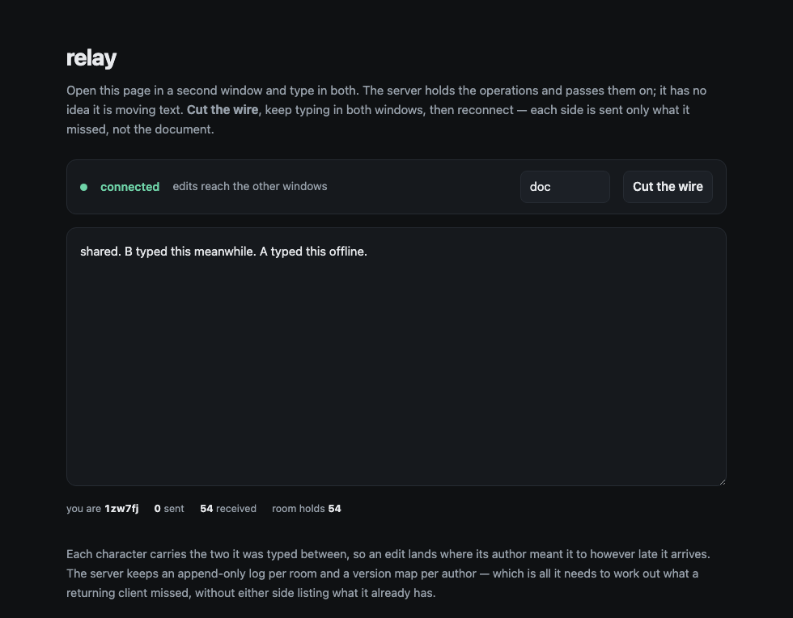

# relay

[](https://github.com/Mustafa0u0/relay/actions/workflows/ci.yaml)

A sync server for operation-based CRDTs. It keeps a log per room, catches up
whoever joins, and passes on what arrives — **without ever understanding what
it is relaying.**



Open the page in two windows, cut the wire in one, keep typing in both, and
reconnect. Each side is sent only what it missed.

## The server does not know it is moving text

An operation's `body` is opaque and stays that way. The server reads exactly
one thing — `{ agent, seq }` — and that is enough to do its whole job:

```ts
export interface Entry {
  readonly id: OpId;      // { agent, seq }
  readonly body: unknown; // never inspected
}
```

The same server would carry a spreadsheet, a drawing or a task list with no
line changed. A server that understood the data type would need redeploying
every time a client learned a new one.

## Catch-up is two version maps and no round trips

Each author numbers their own operations without gaps, so *"seen agent A up to
41"* summarises the whole run in one number. A joining client says what it has,
and gets back exactly the gap:

```
→ { type: "join", room: "doc", have: { alice: 12 } }
← { type: "welcome", ops: [ …13 onward… ], version: { alice: 40, bob: 7 } }
```

A client that has been away for a week and one that has never connected are the
same question with a different answer. Neither enumerates what it holds, and
neither acknowledges operations one at a time.

**Ordering is enforced, not assumed.** An operation is only accepted if it is
the next one from that author. Without that rule the version map develops holes
below its own high-water mark, and a late arrival is mistaken for a duplicate
and dropped.

## Sync runs both ways, and getting that wrong is silent

The first version only sent operations *down* — a client reconnected, was told
what it missed, and never mentioned what it had done while disconnected. Both
sides then believed they were in sync while holding different documents.

The `welcome` carries the server's version precisely so the client can work out
what the *server* never received, and push it. That failure produced no error
and no warning; it was only visible by opening two browsers, disconnecting one,
and comparing the text afterwards.

## What else is deliberate

**Nothing is echoed to its author.** They applied it locally the moment it was
typed, which is what makes an editor feel immediate. Echoing would apply it
twice.

**A duplicate push is not rebroadcast.** A client retrying after a dropped
connection would otherwise hand every other client a second copy of operations
they have already applied.

**A malformed frame is refused and the connection survives.** Every field
crossing the wire is checked — a server that can be stopped by one bad frame
can be stopped by anybody who sends one.

**Room names cannot escape the data directory.** `../../etc/passwd` is a legal
string and is not a legal path; names are encoded before they become filenames.

**Rooms are saved on a timer, not per operation.** Typing produces an operation
per keystroke, and writing the whole room to disk that often makes the server
slower the longer it stays up. Writes go to a temporary file and are renamed,
because rename is atomic — a crash halfway through leaves the old document,
never half of a new one.

## Running it

```bash
npm install
npm run build
npm start
```

Then open <http://localhost:8080> in two windows.

| variable | meaning |
|---|---|
| `PORT` | default `8080` |
| `DATA_DIR` | where rooms are written; unset keeps them in memory |

## Tests

```bash
npm test
```

26 tests. The protocol ones open real ports and speak real JSON over real
frames — mocking the transport would test the mock. They cover a late joiner
being caught up in one message, a client that drops and returns receiving only
the gap, a room surviving a restart, malformed input, and a room name trying to
climb out of its directory.

One bug those tests found: the set tracking which rooms had been loaded from
disk was module-level, so a second server in the same process believed a room
was already hydrated and served it empty. One server per process hides that in
production; a test that starts two finds it immediately.

## What is not here

The client's CRDT lives in `public/client.js` and is **not** unit-tested — it is
a demonstration of the server, and the tests are pointed at the server. The
algorithm it uses is written up properly in
[weft](https://github.com/Mustafa0u0/weft), where it is tested.

There is no authentication and no authorisation. Anyone who can reach the port
can join any room. That is a deliberate omission rather than an oversight: it is
a sync server, and who is allowed into a document is a question for whatever
sits in front of it.
